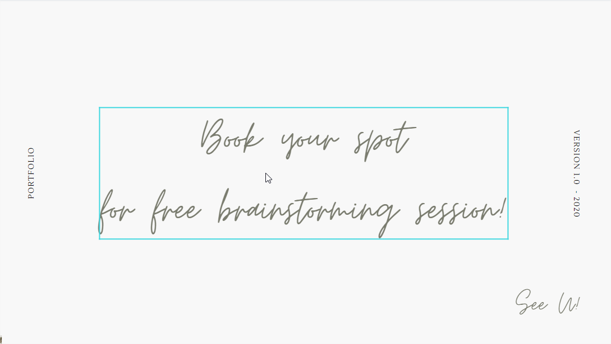

### Hi, I'm Yana! Freelance digital marketer based in Belgium. If you are ready to upgrade your business to live and breath under the digital world, I'm your best bait!

  

> _Pretty soon to be able to be your developer as well!_  

* [Professional Background](#who-i-am)
* [Service Offered](#what-do-i-do)
* [Contact](#where-to-reach-me)

---

## Who I am
I am a **digital enthusiast** who has an experience in E-Commerce and now dedicates her time on the internet. Then social media marketing and content marketing are not a new thing for me. Thanks to **Google Atelier and Academy** who provides women a pack of training to develop our skills in other parts  of digital marketing world, I am now confident with _SEO, SEA, Google Analytics, (...)._ 

The great thing is **I am business graduate!** From _Solvay Business School - VUB master program._ Thus, market and customer research are my day to day food. Wait, _who says that digital marketing is all about ranking?_ Then, you are not even halfway there...

> _**Digital marketing is more about customer experience!**_ 

And belive me, you will need a _social_ person to do that! = ME!

---

## What do I do
* Content and Social Media Marketing
  * Youtube
  * Instagram
  * Facebook
  * Blog
* Search Engine Marketing (SEM)
* Search Engine Optimization (SEO)
* E-Commerce Project
  * Google Shopping
  * WooCommerce, Shopify
* Email Marketing

---

## Where to reach me
| Direct | Social Media |
|---|---|
| adek.impianna@gmail.com | [Github](https://github.com/adekimpianna) | 
| +32 abcdefghijkl | [LinkedIn](https://www.linkedin.com/in/adek-impianna-62a119161/) | 

---

